These diagrams render every page of the checked-in [Drawio source](arch.drawio).
They describe the source document, not a live inventory or health check. Pages
marked **Archive** retain the source's historical classification.
Open an image for its full-size SVG.

## DC1

[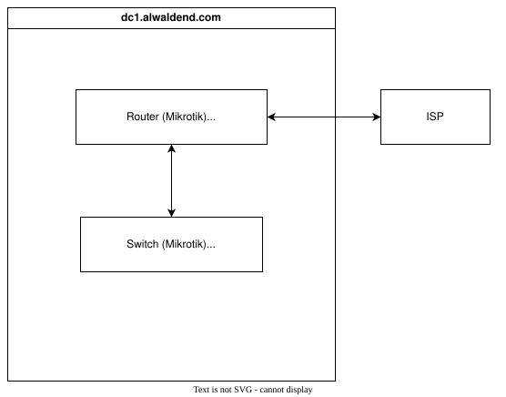](assets/dc1.svg)

## Vault

[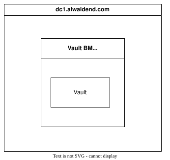](assets/vault.svg)

## Flux

[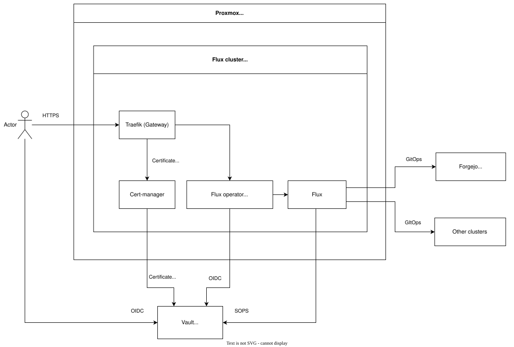](assets/flux.svg)

## Forgejo

[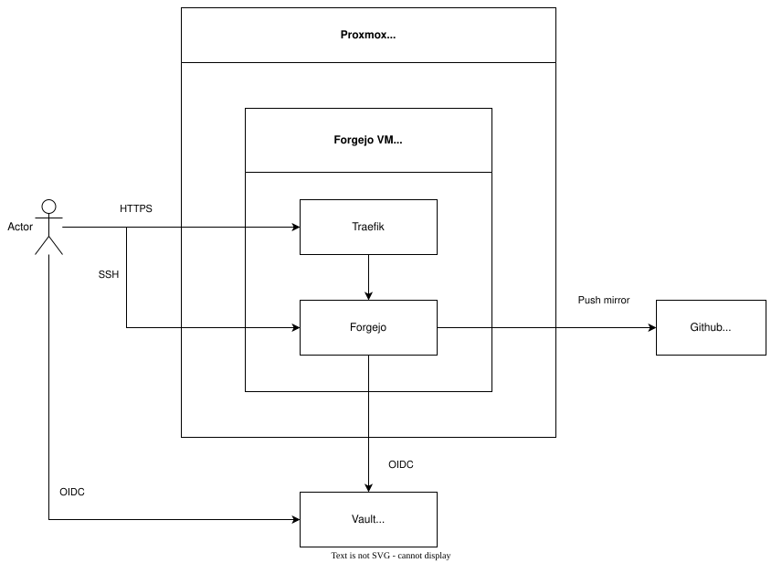](assets/forgejo.svg)

## www

[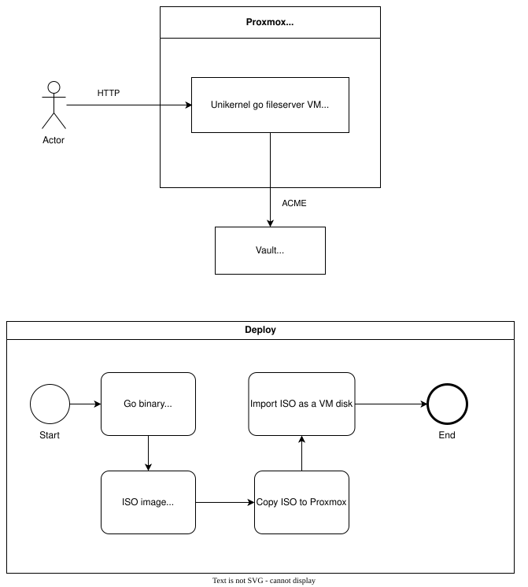](assets/www.svg)

## Threexui

[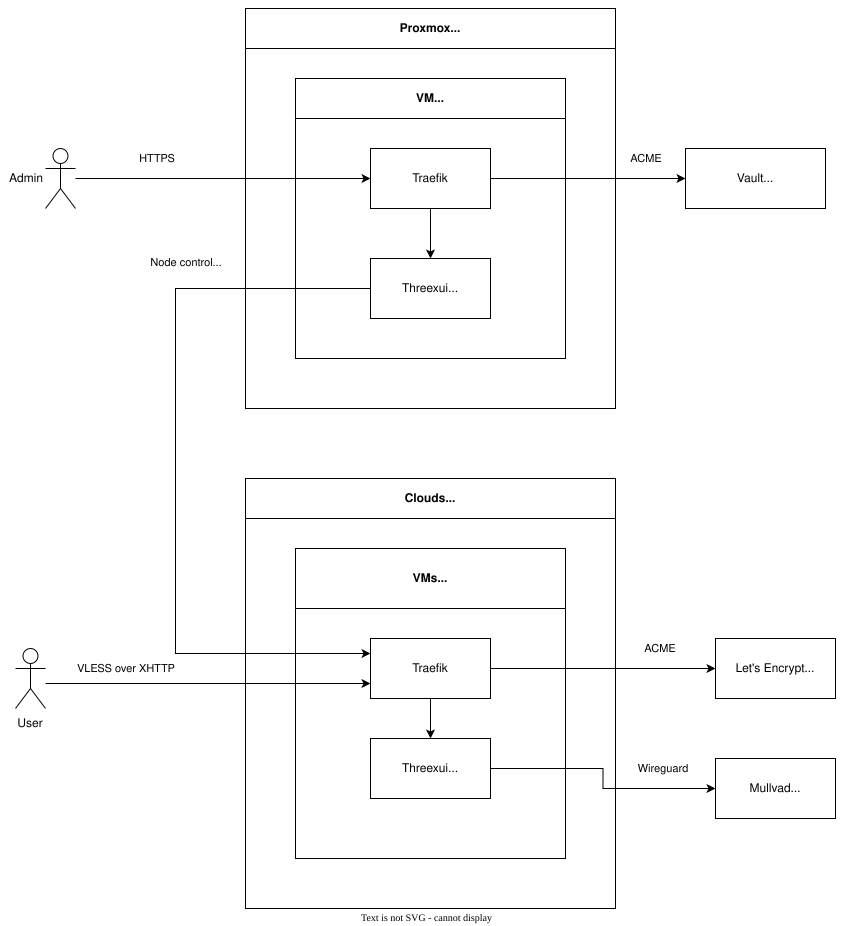](assets/threexui.svg)

## DNS

[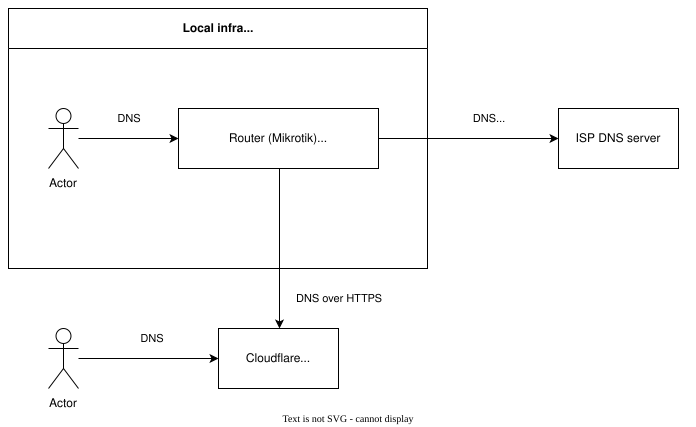](assets/dns.svg)

## Ingress

[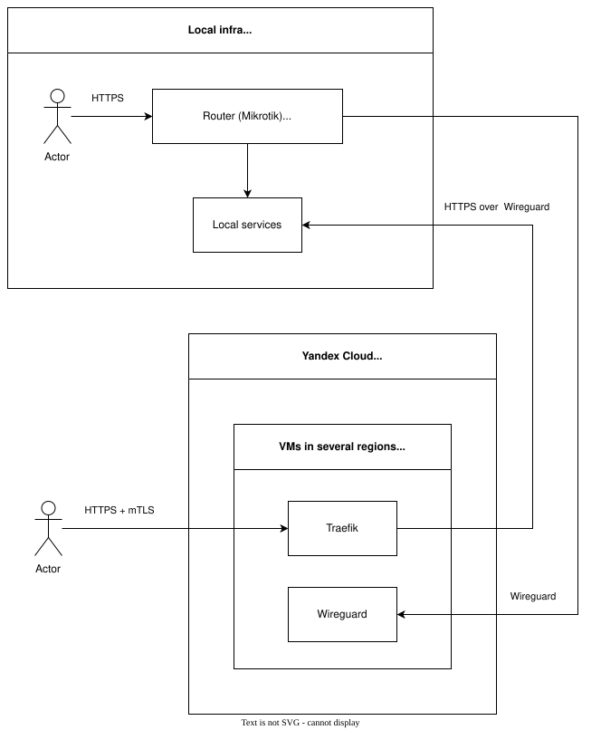](assets/ingress.svg)

## T3code

[](assets/t3code.svg)

## Truenas

[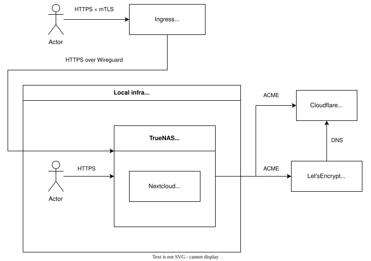](assets/truenas.svg)

## Archive/Harvester

[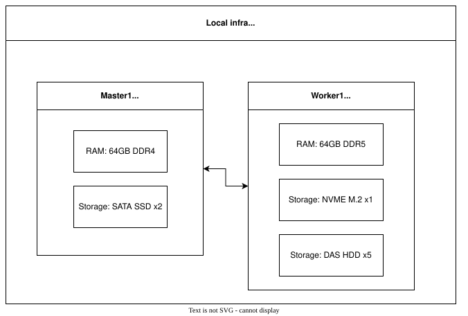](assets/archive-harvester.svg)

## Archive/Opencode

[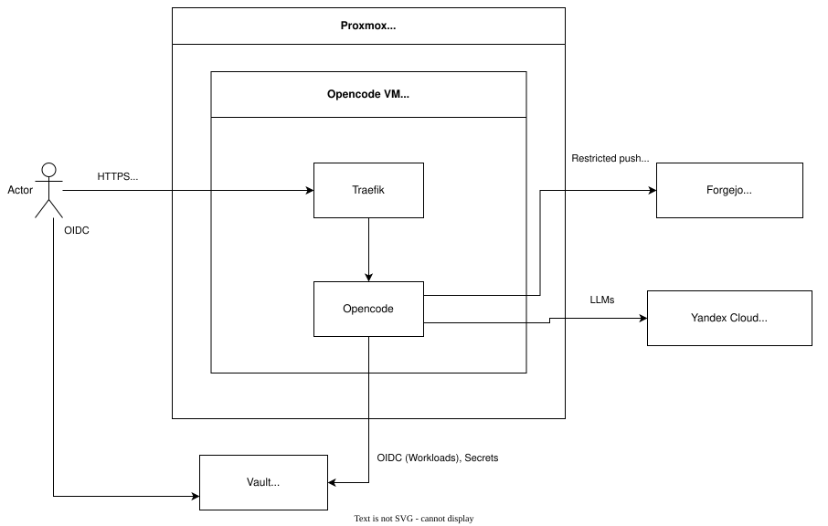](assets/archive-opencode.svg)

## Archive/Hermes

[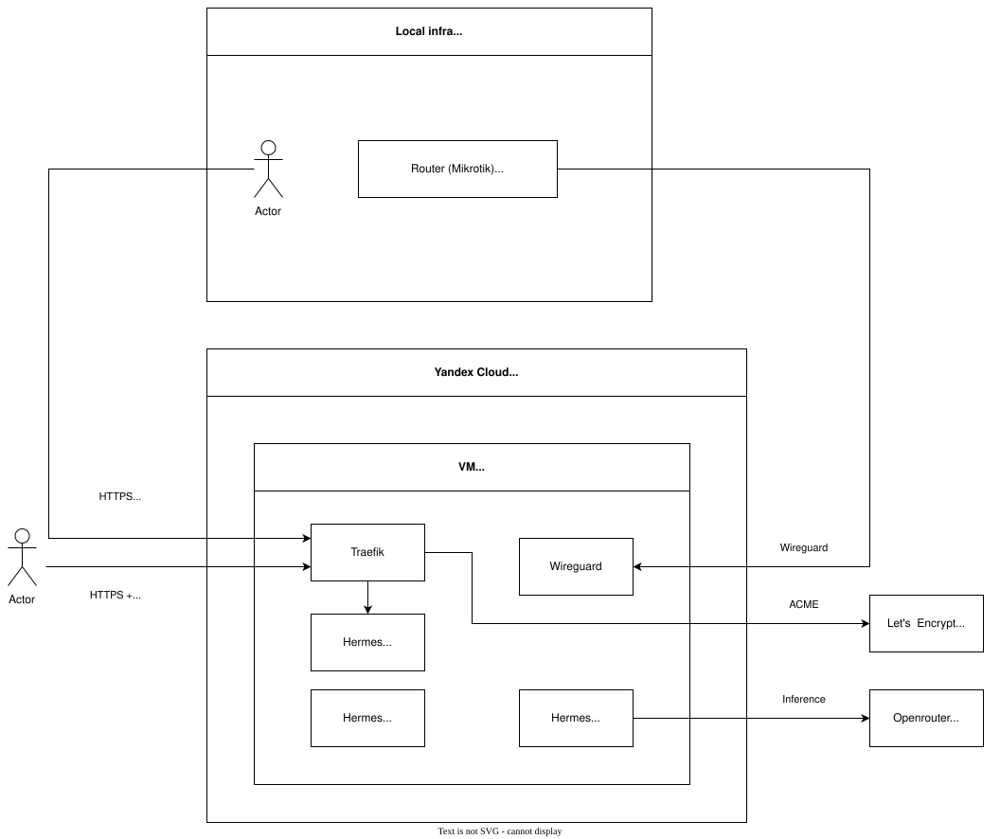](assets/archive-hermes.svg)

## Archive/Proxmox

[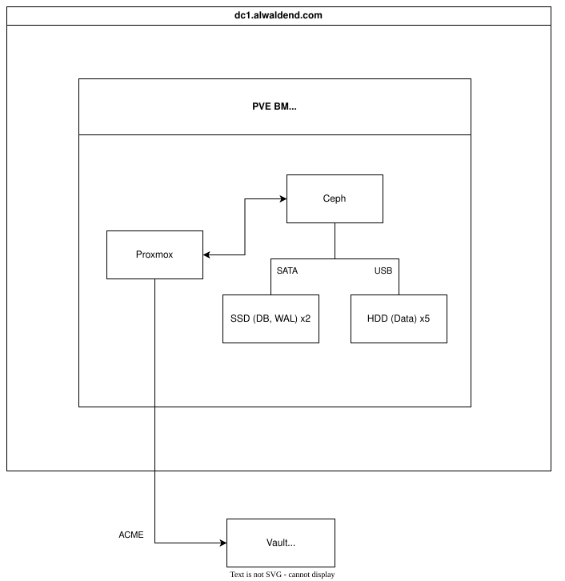](assets/archive-proxmox.svg)

## Archive/Harbor

[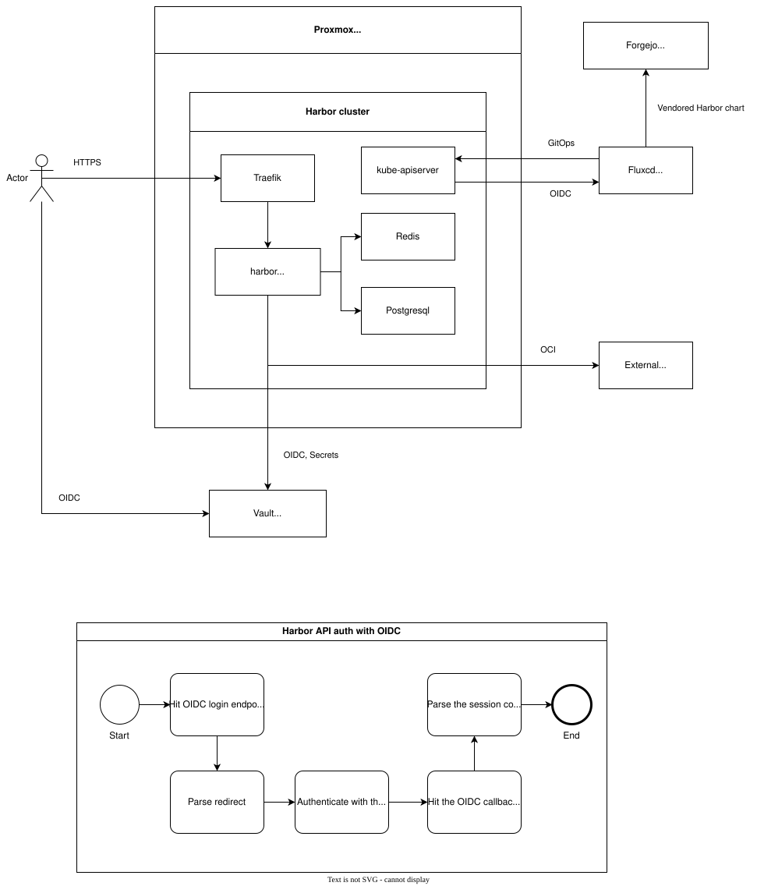](assets/archive-harbor.svg)

## Edit and regenerate

Open the canonical source with the pinned Drawio desktop tool:

```sh
bazel_agent bazel run //infra/arch
```

Regenerate the maintained SVGs after editing `arch.drawio`:

```sh
bazel_agent bazel run //infra/arch:update
bazel_agent bazel test //infra/arch:update_tests
```

The update target renders all 15 named pages in Bazel sandboxes with Drawio
30.2.6 web assets from the [pinned desktop archive](https://github.com/alwaldend/src/blob/master/third_party/com_drawio_desktop_bin/binary_toolchain.json)
and the repository's [pinned headless Chrome](https://github.com/alwaldend/src/blob/master/tools/mermaid/binary_toolchain.json).
A [pinned Liberation font set](https://github.com/alwaldend/src/blob/master/tools/drawio/include.MODULE.bazel) and isolated
Fontconfig configuration keep text measurement independent of host fonts.
The renderer loads only local assets, fails on missing pages and export errors,
and records the source SHA-256 in each SVG. No display server, live infrastructure
access, or runtime download is required. The freshness test compares rendered
output with the maintained SVGs; documentation consumes those checked-in images.
