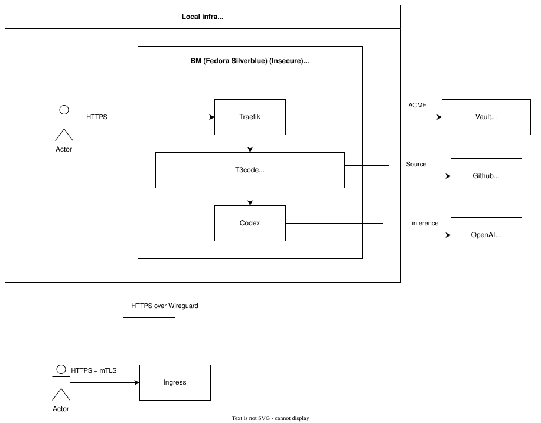

I have some diagrams in the repo, as one naturally does. My diagrams do not look particularly pretty, but they display information, which is the whole point.

In the BC (Before Clanker) era, I made them manually using Drawio's desktop app. I used this approach because it requires no setup and no effort - you just fire up the app and then click things in the UI. Everything is local, and the diagrams themselves are XML, so you can version control them. It's the AC (After Clanker) era now, so I need to be able to have clankers modify my diagrams, and I have more options in general, so I've decided to improve them.

## New tool

The first goal was, of course, to make them prettier - I wanted to see something pleasing to the eyes, not ugly boxes and straight arrows. Ideally, something like [Excalidraw](https://excalidraw.com/) - hand-drawn look, rounded corners, curved edges, all the rage.

The second goal was to simplify their source representation. Drawio diagrams are XML, so they can be version controlled and clanker-managed, but they are too complex and not readable. I wanted a simple DSL that allowed me to just describe the diagram itself - nodes, labels, edges, etc.

The third goal was theme support. While every diagram was supposed to be as simple as possible, they all should look pretty and use one style without being a part of the same project.

The fourth goal was hermeticity. All these diagrams should be rendered locally and hermetically through Bazel without a CDN or any other funny business.

In the end, I've settled on [Mermaid](https://github.com/mermaid-js/mermaid) because it's the first big Open Source project I've found that fit my criteria and I did not care enough to research other options. After all, we are in the AC era - I can just rewrite things.

## Rendering

I wrote some Bazel rules that hermetically render Mermaid diagrams using [Mermaid](https://github.com/mermaid-js/mermaid) (duh), [Chrome for Testing](https://developer.chrome.com/docs/automation-and-testing/chrome-for-testing) for actual rendering, and [Architects Daughter](https://github.com/google/fonts/blob/main/ofl/architectsdaughter/METADATA.pb) as a font. Those rules had to generate a custom [Fontconfig](https://www.freedesktop.org/wiki/Software/fontconfig/) configuration file because Chrome stubbornly tried to use host fonts.

## Style

The default Mermaid style is very bad, so I've made a custom theme, which was pretty easy - it's just a config. Theming is not powerful enough, though - Mermaid 11's hand-drawn renderer hardcodes square corners for flowchart containers, for example, and I had to add post-processing for SVGs to embed my custom font inside of them.

Default theme:



Custom theme:



## Layout

While styling was pretty straightforward, there were a lot of problems with the layout.

In no particular order:

- No way to properly control width: The only real lever is the direction.
- The direction is not reliable: You can control the overall direction, but direction inside of groups is often ignored.
- Container titles: An edge can draw over a container title, and there is no way to avoid it, so I had to add postprocessing for this.

## Diagram types

I've looked into diagram types other than flowchart, and there was nothing even remotely suitable except for an [architecture diagram](https://mermaid.js.org/syntax/architecture.html). A shame that it looks even worse than the default theme:



## Final look

Here is the old Drawio diagram:



It looks bad and its source is unreadable and the diagram is unmaintainable without a GUI.

Here is the new Mermaid diagram:



It's readable and looks pretty. I like it.

Here is its source. It's also pretty and readable:

```text
flowchart LR
    subgraph internet["Internet"]
        direction TB
        remote("Actor")
        ingress("Ingress")
    end

    subgraph dc1["Local infra<br/>dc1.alwaldend.com"]
        direction TB
        intranet("Actor")
        vault("Vault<br/>vault.alwaldend.com")

        subgraph host_bot["Bare metal host<br/>host-bot.simeonwarren.users.alwaldend.com"]
            direction TB
            traefik("Traefik")
            t3code("T3 Code")
            codex("Codex")
        end
    end

    subgraph external["Internet"]
        direction TB
        github("GitHub<br/>github.com")
        openai("OpenAI<br/>openai.com")
        openrouter("OpenRouter<br/>openrouter.ai")
    end

    remote -->|"HTTPS + mTLS"| ingress
    intranet -->|"HTTPS"| traefik
    ingress -->|"HTTPS over Wireguard"| traefik
    traefik --> t3code
    t3code --> codex
    traefik <-->|"ACME (HTTP)"| vault
    t3code -->|"Source"| github
    codex ---|"Inference"| inference@{ shape: junction }
    inference --> openai
    inference --> openrouter

    classDef actor font-style:normal;
    class remote,intranet actor
```

In the end:

- Diagrams are pretty, check. Although they still lack some pizzazz.
- Source is simple, check.
- Unified theme, check.
- Hermeticity, check.
