# Goal architecture

The goal tool is a local CLI for one coordinator working on a goal at a time.
It edits ordinary files inside the workspace. It does not require a service,
daemon, database, controller, or network connection.

The tool release is `0.0.1`. The independent resource-schema version is
`goals.alwaldend.com/v1alpha1`; `v1alpha1` describes schema stability and does
not imply a stable tool release.

## Goal pursuit loop

The pursuit loop belongs to the goal skill and its coordinator. The CLI does
not schedule or perform the work; it validates and checkpoints the state
transitions chosen by the coordinator.



The editable Mermaid source is [goal-loop.mmd](goal-loop.mmd).

## System flow



The editable Mermaid source is [goal-tool.mmd](goal-tool.mmd).

## Files

Structured resources use Kubernetes-style YAML envelopes. Attempt plans,
results, and evidence are canonical, digest-bound Markdown artifacts;
`README.md` is a generated Markdown projection. A catalog has this shape:

```text
goals/
  <goal-id>/
    goal.yaml
    criteria.yaml
    criteria-revisions/<revision>.yaml
    README.md
    attempts/<attempt-id>/
      attempt.yaml
      plan.md
      result.md
      evidence/*.md
```

Lock files live under `$XDG_RUNTIME_DIR/alwaldend/goal/locks/`, outside the
workspace. They are local adapter state, not Kubernetes resources, and can
never be added to version control.

## Update model

The orchestrator assigns one coordinator to a goal. The CLI independently
prevents overlapping cooperating processes. An attempt or lifecycle mutation
through `checkpoint` follows this path:

1. Resolve the canonical goal path, hash it into a lock path under
   `$XDG_RUNTIME_DIR/alwaldend/goal/locks/`, and take an exclusive `flock` for
   that goal.
2. Read and validate the current resources under the lock.
3. Reject a stale expected `resourceVersion`.
4. Build and validate the proposed resource values in memory. Fully stage a
   new attempt in a hidden sibling directory when needed.
5. Publish `goal.yaml` with the advanced resource version as the optimistic-
   concurrency commit point.
6. Publish the staged attempt directory with one rename, or replace existing
   attempt files through sibling temporary-file renames.
7. For a newly created attempt closed by the same checkpoint, finalize
   `goal.yaml` at the same resource version.
8. Write the replaceable `README.md` projection last and release the lock.

The first goal write for an immediately closed new attempt deliberately keeps
an active-attempt pointer until the attempt directory exists. Interruption
before attempt publication or finalization therefore leaves an invalid record
instead of silently losing the attempt. Any error after the commit point
identifies the resource version that committed; validate the record before
resuming.

Reads and mutations use the same exclusive per-goal lock, matching the
single-coordinator ownership model and leaving one unambiguous holder PID.
Different canonical goal paths have different lock files and therefore do not
block one another. Lock files are never deleted as part of normal operation;
deleting a lock pathname while a process holds its inode would allow a second,
unrelated lock to be created.
The holder writes its PID into the lock file after acquiring `flock` for
diagnostics. The kernel lock, not PID-file existence, remains authoritative;
a clean release truncates the PID while still holding `flock`, while a crash
releases the kernel lock and leaves the last PID for diagnosis. The next
holder overwrites that stale PID. A PID is never authority to unlink or
recreate the persistent lock path because another waiter may already have its
inode open.
The operating system may clear `XDG_RUNTIME_DIR` after all processes have
stopped; no canonical state lives there. The command fails clearly when a
usable `XDG_RUNTIME_DIR` is unavailable.

The key includes the full canonical absolute path, not only the goal ID. Two
parallel workspaces can therefore operate on same-named goals independently,
while two symlink spellings of the same goal still coordinate through one
lock.

Legacy migration is a non-destructive two-path operation. It rejects equal or
overlapping canonical source and target paths, acquires their locks in sorted
order, and never writes into the source. The command builds a complete
`<goal-id>` below a hidden staging directory in the destination goals root,
runs the normal record validator there, rechecks that the target is absent,
and re-digests the source. It then publishes the staged goal with one directory
rename. A matching existing target is an idempotent result; any other existing
target is refused.

Promotion likewise acquires the distinct source and destination goal locks in
canonical-path order before it validates and publishes the destination.

The runtime directory is private to the current user. Each lock path is opened
without following a final symlink, then checked to be a regular, same-user,
single-link inode before use. The workspace side remains a cooperative
pathname boundary: the workspace and goal path must remain stable during a
command. The CLI rejects path escapes and observed symlinks, but it is not a
sandbox against another process running as the same user that races pathname
replacement.

Atomic rename prevents a reader from seeing a partially written file. A
command that replaces multiple files publishes them in a defined order; if it
is interrupted between renames, validation reports any resulting inconsistency.
Canonical state consists of validated YAML resources and the exact `plan.md`,
`result.md`, and `evidence/*.md` bytes whose SHA-256 digests are stored in each
`attempt.yaml`. Recognized temporary-file residue is removed before validation;
the generated `README.md` projection is replaceable and non-canonical.

## Graph model

Goal relationships are typed references in `Goal.spec`: parent, dependency,
and supersession. Catalog graph analysis is a pure, deterministic projection
of fully validated goal records, including their digest-bound Markdown
artifacts. Each edge kind is checked separately for cycles; missing references
remain unknown instead of being invented or silently accepted as resolved.

`set-relationships` replaces the dependency and supersession lists completely;
omitting the parent flag preserves the parent, while `--clear-parent` removes
it. Every accepted request advances `metadata.generation` and
`metadata.resourceVersion`, even when the requested normalized relationships
equal the current values. The command fully validates the target record under
its goal lock and rejects relationship changes while an attempt is active,
because attempts are bound to the goal generation and portable state digest.
It writes the authoritative `goal.yaml` first and refreshes the replaceable
README projection last.

Relationship updates reject a newly introduced cycle or an expansion of an
existing cycle for the affected edge kind. Existing unrelated cycles do not
block a repair, and shrinking the target's existing cycle is allowed.

Cycle prevention is deliberately snapshot-scoped. The command assembles a
catalog view by reading each member under that member's per-goal lock, then
validates and writes the target under its lock; it does not take a catalog-wide
lock. Two coordinators that concurrently change different goals can therefore
each validate before the other write and jointly create a cycle. This is the
accepted consequence of independent per-goal locking and the single-
coordinator ownership model, not a serializable graph transaction. After the
writers settle, a subsequent `graph` call reports the cycle deterministically
so a coordinator can revise one edge.

Task scheduling, live agent topology, messages, and runtime state remain
responsibilities of the agent harness. The local tool stores durable goal
relationships and evidence provenance as ordinary resources.

## Kubernetes boundary

The YAML resources follow Kubernetes API conventions so a future adapter can
map them to CRDs. Local files are not directly applicable cluster objects.
Cluster use would still require structural CRDs, API-server-owned metadata,
status-subresource behavior, and a controller or client that maps Markdown
artifacts and local annotations.

That adapter would replace the filesystem lock and rename mechanism with
API-server concurrency. It must not carry the local lock files or emulate the
filesystem backend inside Kubernetes.
