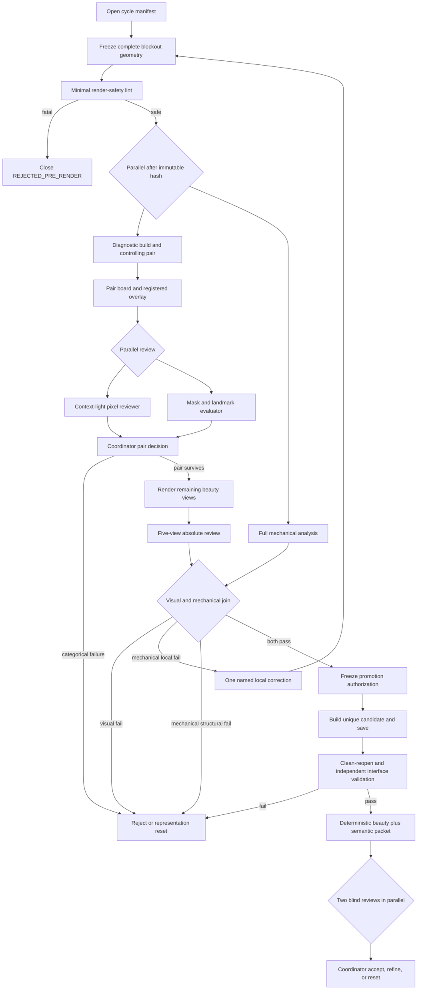

# A79 diagnostic-first iteration loop

## Outcome and verdict

The bottleneck is gate ordering, not image generation. A79 placed
promotion-grade representation, topology, root, thickness, and interface
proofs ahead of any disposable pixels. It consequently produced three
pre-render resets and a large validation surface while the active goal still
reported that no candidate had been rendered.

The late non-candidate probe disproves that ordering. Its five fixed 512 px
beauty views rendered in `29.115 s` total, clean-reopened, and preserved the
protected hashes. Those pixels immediately reject the frozen representation:
the crown is bald, the rear base is a rigid rectangular curtain, and the free
leaf is a planar hanging board. See
`diagnostic_preview/a79_non_candidate_five_view.png` and
`diagnostic_preview/DIAGNOSIS.md`.

Decision-review verdict: **revise** the loop to use two lanes:

1. a cheap, explicitly non-promotable visual-falsification lane; and
2. the existing strict, content-addressed promotion lane, entered only by a
   visual survivor.

The strongest case for the old ordering is that it caught real unsafe or
structurally invalid candidates. That remains necessary for promotion. Its
decisive failure is using those expensive checks to withhold safe diagnostic
pixels. A persistent mutable GUI session would be faster in some edits but
adds state and toolchain risk; the selected design remains pinned,
background, snapshot-based, and repository-native.

## Service-level objective

Every cycle starts with one dominant visible defect and one bounded
hypothesis.

- First diagnostic pixels: at most `12 min` after cycle start and at most
  `60 s` after geometry freeze.
- Normal rejected cycle: decision within `15 min` wall time.
- No new preflight, contract, or prose layer before first pixels unless it
  prevents a protected-source mutation, path escape, Blender crash, or
  unreviewable subject identity.
- Missing the first-pixel deadline closes the cycle as a process miss. The
  next action is to simplify the representation or diagnostic path, not add
  another proof layer.
- Promotion validation may be slower, but it is paid only once per visual
  survivor.

The first-pixel clock and every stage duration are recorded in `decision.json`.

## Non-negotiable safety invariants

- Protected rung 003 remains the only branch and comparison baseline:
  `out/reimu_fumo_working_ladder/rung_003_eyes_locks_sleeves/`
  `reimu_fumo_working_rung_003.blend`, SHA-256
  `c538a9aa070c4f0e127b6ace3b42220ae096c6e7a7fb1791b8906fd02f78bd3b`.
- The tracked asset remains immutable at SHA-256
  `489213b7d0a62feb5c6b60ce36483757638886af3a4af25efa41e402e46b1d76`.
- Use repository-pinned Blender `5.2.1` through `bazel_agent`; no host Blender.
- Begin from factory startup and append the protected scene into a fresh main
  file. Never open the protected file as the save target.
- Every worker writes to a unique cycle directory. Never overwrite a blend,
  packet, manifest, or report. Disable `.blend1` for task-owned saves.
- A renderer reads only an immutable geometry packet or a completely saved,
  hashed blend. It never races a save and never calls a save operator.
- Hash protected inputs before and after every Blender process. A mismatch
  quarantines all outputs and stops the goal.
- Diagnostic blends, renders, and manifests contain `NON_CANDIDATE` and
  `promotion_authorized: false`. They can reject; they can never authorize
  promotion.
- AUTO-thread diagnostic pixels and FIXED-thread promotion pixels are separate
  series. Never use byte or small-pixel deltas across render environments.
- Fixed camera, crop, projection, and registration remain unchanged. The
  optional mirror profile is comparable only when the same camera exists in
  baseline and candidate.
- One coordinator is the only canonical goal writer and promotion selector.

## Execution DAG

The mechanical branch is non-blocking for diagnostic pixels after the minimal
safety lint. It becomes a mandatory join before promotion.

## Stages, budgets, and hard exits

| Stage | Target / hard budget | Output | Hard early exit |
| --- | --- | --- | --- |
| Cycle declaration | `2 / 3 min` | `cycle.json` | More than one dominant defect, no controlling and regression-risk view, or no falsifiable expected pixel effect. |
| Complete blockout | `8 / 10 min` | immutable geometry JSON | The three A79 visual roles are not present together, the exact six-object boundary changes, or the author starts material/detail work. |
| Minimal safety lint | `5 / 15 s` | `lint.json` | Hash mismatch, path escape/symlink, malformed schema, non-finite coordinate, invalid index, empty mesh, protected alias, unexpected object name, or resource limit likely to crash Blender. |
| Diagnostic pair | `35 / 60 s` from freeze | scratch blend plus two beauty PNGs | Blender identity/file identity failure, protected hash drift, missing camera, blank/clipped output, or output outside the cycle root. |
| Pair board | `3 / 10 s` | board and overlay | Registration error exceeds the target tolerance; mark measurement unverified rather than judging a false overlay. |
| Pair review | `60 / 120 s` | `diagnostic_review.json` | Any helmet, egg, canopy, curtain, card, blade, bald crown/rear, beige leak, floating root, hard shell, or disconnected construction; or any critical regression in the risk view. |
| Remaining beauty views | `25 / 45 s` | three additional PNGs | Stop on the first streamed categorical failure; do not finish a doomed packet mechanically. |
| Full mechanical analysis | `60 / 180 s`, parallel | `mechanical_report.json` | Structural representation failure resets; one local, named failure may receive one correction only. |
| Five-view decision | `90 / 180 s` | updated review and `decision.json` | A79 internal gate fails: macro `<6/10`, construction `<5/10`, contact `<6/10`, categorical defect, or not preferred to rung 003 in every affected view. |
| Promotion build/save | `60 / 120 s` | candidate blend and build report | Any authorization/hash/source-delta/pre-save gate fails. Partial saves remain quarantined and are never reused. |
| Reopen plus interface | `120 / 300 s` | two independent reports | Saved hash/file identity, exact source delta, topology, roots, crossings, semantic rear coverage, or protected hashes fail. |
| Promotion packet | `180 / 300 s` until remeasured | 5 beauty + 5 semantic, manifest, `READY` | Any render failure or manifest mismatch. Serialize this Blender workload. |
| Two blind reviews | `120 / 240 s`, concurrent | two reviews | Either reviewer finds a major visible defect. Final goal acceptance still requires every applicable category `>=8/10`; A79 is only a working-rung gate. |

The diagnostic timing budgets are anchored to the observed A79 run:
`5.244`, `6.123`, `5.369`, `6.260`, and `6.118 s` per 512 px view. The
existing harness estimate of `180--300 s` applies to the deterministic
beauty-plus-semantic promotion packet and must not be charged to every
blockout. Recalibrate each budget from the latest three same-environment
manifests; do not infer throughput from latency.

## What runs concurrently

The coordinator owns canonical state and the decision queue. Normal-cycle
work in progress is one geometry hypothesis.

After the geometry hash is frozen:

- the Blender diagnostic worker builds/renders its isolated snapshot;
- the mechanical worker evaluates the same immutable JSON into a disjoint
  directory; and
- the coordinator does not wait for the mechanical result before viewing
  diagnostic pixels.

After the diagnostic pair exists:

- one context-light reviewer receives only references, pair renders, and the
  current stage;
- one metrics worker composes registered overlays and evaluates masks; and
- neither sees implementation details or writes canonical state.

After a promotion packet exists, the two required implementation-blind reviews
run concurrently. Blender render jobs themselves remain serialized because
contention has previously dominated latency and mixed environments break the
regression series.

Only after a representation reset may two blockout authors run concurrently.
They each receive the exact same immutable rung/hash and distinct cycle roots,
must each provide all three visual roles, and are capped at two variants. The
coordinator reviews the first pair packets promptly and stops the loser; the
variants are never merged.

## Exact artifact interfaces

Each cycle owns
`process_optimization/cycles/<cycle_id>/`; all paths below are relative to
that directory and are immutable after `decision.json` closes the cycle.

### `cycle.json` — `a79-iteration-cycle/v1`

Required fields are `cycle_id`, `attempt_id`, `started_utc`, `baseline.path`,
`baseline.sha256`, `tracked_asset.path`, `tracked_asset.sha256`,
`toolchain.path`, `toolchain.sha256`, `geometry.path`, `geometry.sha256`,
`interface_contract.sha256`, `reference_registration.sha256`, and
`hypothesis`. `hypothesis` contains exactly `dominant_defect`,
`representation`, `bounded_change`, `controlling_view`, `regression_view`,
`expected_effect_by_view`, `accept_condition`, and `reset_condition`.

### `lint.json` — `a79-diagnostic-lint/v1`

Required fields are `geometry_sha256`, `safe_to_diagnose`, `checks[]`,
`protected_hashes`, `limits`, and `elapsed_seconds`. Every check has
`name`, `status` (`PASS` or `FAIL`), and `evidence`. This report grants only
`safe_to_diagnose`; it has no promotion field.

### `diagnostic/manifest.json`

Reuse `a79-non-candidate-diagnostic/v1`. Require `status: NON_CANDIDATE`,
`promotion_authorized: false`, exact source and geometry hashes before/after,
Blender/background identity, scratch-blend path/hash, hidden source objects,
and one row per render with camera, dimensions, path, hash, and seconds.
The first two rows are the declared controlling and regression views and are
published as soon as their PNGs close. `diagnostic/reopen.json` uses
`a79-non-candidate-reopen/v1` and proves file identity without upgrading the
artifact.

### `mechanical_report.json` — `a79-mechanical-analysis/v1`

Required fields are `geometry_sha256`, `contract_sha256`, `status`,
`representation_failures[]`, `local_failures[]`, and raw evidence links for
topology, paired thickness, roots, crossings, visibility delta, aperture, and
rear coverage. `status` is `PASS`, `LOCAL_FAIL`, or `STRUCTURAL_FAIL`.

### `diagnostic_review.json` — `a79-pixel-review/v1`

Required fields are `packet_sha256`, `reviewer`, `context_isolation`,
`recognizable_same_variant`, category scores, ordered discrepancies,
`categorical_defects[]`, `view_regressions[]`, and `verdict`. The verdict is
`REJECT`, `REFINE`, `RESET`, or `VISUAL_SURVIVOR`. Previous candidates,
topology, measurements, and author intent are excluded from the first review.

### `decision.json` — `a79-cycle-decision/v1`

Required fields are the exact geometry, diagnostic, mechanical, and review
hashes; `decision`; `dominant_remaining_defect`; `next_bounded_change`;
`cache_hits[]`; and stage timing rows with target, actual, and budget status.
Allowed decisions are `REJECT`, `REFINE_ONCE`, `RESET_REPRESENTATION`, and
`ENTER_PROMOTION`. Only the coordinator writes it.

### Promotion artifacts

Reuse the implemented schemas rather than inventing another lane:

- `candidate/authorized_inputs.json`:
  `a79-candidate-authorization/v1`;
- build report: `a79-candidate-build/v1`;
- clean reopen: `a79-candidate-clean-reopen/v1`;
- interface report: `a79-paired-hair-validation/v1`;
- render packet: current `render_harness` manifest plus `READY`.

The authorization must bind the exact diagnostic-survivor geometry hash and
both PASS reports. A diagnostic blend is never renamed into the candidate
lane.

## Cache and reuse boundaries

| Cache | Key | Reuse rule |
| --- | --- | --- |
| References, extracted frames, registration, crops | every reference hash + registration hash | Reuse across cycles while all hashes match. |
| Rung camera/interface inventory | rung hash + Blender/tool source hashes | Reuse read-only; rehash the protected rung around each Blender operation. |
| Baseline beauty/semantic packet | rung hash + render spec + tool sources + Blender version + render environment | Render once. Never mix host/sandbox, AUTO/FIXED, or changed camera series. |
| Pure geometry report | geometry hash + validator hash + contract hash | Exact-key reuse only. |
| Diagnostic blend/renders | geometry hash + baseline hash + diagnostic spec + toolchain/environment | Exact-key reuse only; remains non-promotable. |
| Candidate reopen/interface reports | candidate blend hash + validator hashes + contract + Blender version | Exact-key reuse only; any candidate-byte change invalidates them. |
| Visual review | exact packet/board hash + reference packet hash | Reuse only for byte-identical images; otherwise review blind again. |

Do not recursively hash the ever-growing harness tree on diagnostic cycles.
Capture the full manifest only at promotion. Batch views inside one Blender
process. Run static authorization/geometry checks with ordinary Python because
the current `--static-only` path executes before `bpy` import; do not pay for
a Blender startup to reject JSON.

## Stop and reset rules

- Any categorical pixel defect stops the current packet immediately.
- A local correction may touch one named panel/control group once. Any geometry
  change creates a new hash and restarts the diagnostic pair; old pixels do
  not carry forward.
- The same named visible defect surviving two reviewed cycles forces a new
  representation, not more parameters or checks.
- Three identity-defining components failing together returns to a complete
  macro blockout.
- A promotion-grade check discovered before pixels is added to minimal lint
  only if it is necessary to render safely. Otherwise it remains in the
  parallel mechanical or promotion lane.
- At every third closed cycle, and immediately on a missed first-pixel SLO,
  record which stage consumed avoidable time and change the workflow if the
  evidence warrants it.
- A successful command, valid mesh, cleaner topology, or relative improvement
  never overrides the absolute pixel gate.

## Immediate A79 use

The present geometry hash
`2483e49d684836cc4af349e381fd35d2ab91fcf65e7be8a688c980b81988931d`
is closed as a diagnostic rejection. It must not enter promotion. The next
cycle should preserve the exact source boundary and begin with a gross but
complete brown crown/rear/leaf blockout that fixes visible coverage and the
multi-view silhouette. Render its controlling view plus the worse of profile
or rear before refining paired skins, density, roots, seams, or materials.

The generic lesson for long-running goals is: make the smallest safe artifact
that can falsify the outcome first; run promotion evidence in parallel where
possible and at the end where necessary; never let process artifacts displace
visible or behavioral result evidence.
