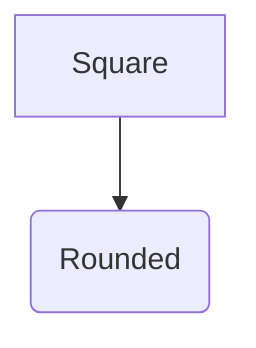

This package exposes the Mermaid CLI as a repository-wide Bazel tool. Bazel
provisions the pinned Node toolchain, JavaScript dependency graph, Mermaid CLI,
and Chrome-for-Testing browser used by Puppeteer. Rendering runs as a Bazel
target or action; it does not use a host browser, download one during an npm
lifecycle hook, or fetch scripts or fonts from a CDN.

[`theme.json`](theme.json) owns the diagram appearance. It applies a
documentation palette, typography, layout, and the `handDrawn` look to every
diagram, so rendered work shares one visual contract instead of Mermaid's
built-in default. Shapes stay semantic: `()` and other inherently rounded
shapes render rounded, while `[]` boxes render as sketched rectangles. Nothing
forces every node into a rounded outline.

The `mermaid_svg` rule and the `mmdc` target both apply the theme by default.
A diagram can override any part of it with its own Mermaid directive, which
Mermaid merges over the file config:



`themeCSS` boxes every edge label and every cluster title, so an annotation
reads as a caption instead of sitting on the edge line. The rule styles the
`<p>` inside a real label and leaves `.labelBkg` transparent; styling
`.labelBkg` directly would draw a stray box wherever an edge carries no text.
Mermaid emits an empty label plate for unlabelled edges under the dagre
renderer but omits it under ELK, so the rule is what the test asserts rather
than any particular empty element.

Each boxed label carries a `3px` margin. Under the dagre renderer Mermaid sizes
a label's `<p>` to the text only, so the frame clips the outer half of the 1px
border and a label appears to have a missing right edge; the margin keeps the
border inside the clip rect. Under ELK the frame already includes the margin,
so the value there is breathing room rather than a correctness fix.

The cluster title plate pins `font-size: 13px`. ELK sizes a container from the
width of its own title plate, so a child container whose title is wider than
its parent's escapes the parent on both sides. Nesting a hostname title inside
a short parent title is the case that exposes this: at the inherited `16px`
the child measured 333px against a 302px parent and escaped 20px per side,
while `13px` fits it with 7px of clearance per side. The plate is a container
label, not body text, so the smaller size also keeps it visually subordinate.

`flowchart.defaultRenderer` selects ELK. It measures a nested cluster's parent
title with roughly 54px of clearance instead of dagre's 11px, and unlike dagre
it leaves room without any negative margin. The alternative dagre settings were
measured and rejected: dagre insets a nested cluster by a fixed 20px that no
spacing option widens, and while it can be tuned wider overall (`nodeSpacing`
and `rankSpacing`), the nested title overlap remains.

`flowchart.subGraphTitleMargin.top` is negative on purpose. Under dagre a
nested cluster keeps a fixed 20px inset from its parent that does not grow with
`nodeSpacing`, `rankSpacing`, `padding`, or this margin, so the parent title
would be overlapped by the container nested inside it, and the negative margin
is the only thing that lifts it clear. ELK does not need the lift, but both
renderers share this one config, so the value stays and keeps the title on the
cluster border. Remove it only after re-checking a diagram with nested
subgraphs.

The cluster title additionally forces `line-height: 1`, which keeps the plate
short enough to sit on the border consistently instead of spilling past it.

`handDrawnSeed` is fixed, so the sketch jitter is stable rather than different
on every render. Pass `theme` on the rule or a later `-c` argument to the CLI
to replace the whole config for one diagram; because a second `-c` file
replaces rather than merges, override only the specific keys you need with a
directive.

## Paint order

Mermaid emits a container title in `<g class="cluster-label">` inside
`<g class="clusters">`, and emits that group before the edges, the edge labels,
and the nodes. SVG paints in document order and offers no other layer control:
`z-index` needs a CSS-positioned box and does not reorder SVG elements, and
`paint-order` only orders fill, stroke, and markers within a single element.
An edge that crosses a container border therefore paints over the title plate
and appears to run through the title text. Mermaid exposes no z-order, layer,
or paint-order configuration key, so this is fixed by rewriting the SVG rather
than by a theme setting.

`cmd/render/paint_order.mjs` moves every title group to the end of the root
group after Mermaid writes the file. Every title is a direct child of the root
group, whose own transform is empty, so lifting a title changes its paint
order without moving any geometry. Measured on the host_bot diagram, an edge
crossed a title in 22 of 57 probes before the lift and in 0 of 57 after. Both
entry points apply the lift, so a diagram rendered through `mermaid_svg` and
the same diagram rendered through `mmdc` paint identically. `mmdc` rewrites the
file named by `-o` or `--output`; an SVG printed to stdout is not rewritten.

## Diagram direction

Write `flowchart TB`. Vertical is the default in this repository because ELK
lays a horizontal graph out wide and flat, which pushes the rendered width past
what a page can show.

## Layout width

Direction, not spacing, is the width lever. ELK ignores the usual spacing
knobs: `nodeSpacing` and `rankSpacing` are ignored, the adapter hardcodes
`spacing.baseValue` and `elk.direction`, and ELK wrapping is compiled out of
the shipped render function. Measured on the host_bot diagram as a
`flowchart LR` graph, the config options that exist move the width by at most
about 2%:

| Option                                       | Width         |
| -------------------------------------------- | ------------- |
| default (BRANDES_KOEPF)                      | 1867px        |
| `elk.nodePlacementStrategy: NETWORK_SIMPLEX` | 1827px        |
| `elk.mergeEdges: true`                       | 1847px        |
| `wrappingWidth` (any value)                  | 1867px, inert |
| `nodeSpacing` / `rankSpacing` (74–400)       | 1867px, inert |

Diagram direction is the effective control. A `flowchart TB` graph of the same
nodes is about 671px wide, roughly a third of the LR width, and the direction
can be set per subgraph with a `direction` statement. Font size also scales
width roughly linearly, so `themeVariables.fontSize` is a secondary lever. The
direction wins over spacing because ELK still honours `elk.direction` while
ignoring the Mermaid-level spacing values.

## Tests

`test/renderer/renderer_test.go` renders fixture diagrams through the
`mermaid_svg` rule and asserts the contract of the theme: the documentation
palette and hand-drawn node class survive, the built-in lavender colors do not,
labels are measured through the pinned fonts, and the label plates keep their
border slack. It also asserts that every container title is written after the
nodes, which is the paint order `cmd/render/paint_order.mjs` produces and the
property that keeps an edge from drawing over a title. `cmd/mmdc/mmdc_test.go`
drives the interactive CLI and re-renders under a Fontconfig pointed at a
monospace-only pool; a byte-identical result shows the CLI resolved text
through the pinned fonts.

## Hermetic rendering

Mermaid measures label text through Fontconfig, so a renderer that follows the
host would produce different canvas geometry on every machine. Both entry
points instead expose only the repository's pinned fonts to Chrome:
`cmd/render/fontconfig.mjs` writes a Fontconfig file whose sole `<dir>` values
are the directory holding the pinned handwriting face and the directory holding
the pinned Liberation set, and whose aliases map the families the theme requests
onto them. The same file is applied by the build action and by an interactive
`mmdc` run, so both resolve identical text metrics.

The generated Fontconfig must use absolute paths. Chrome is a separate process
from the launcher, and a relative `<dir>` resolves against whatever working
directory it inherits rather than the action's execroot. Passing a caller's own
`-p`/`--puppeteerConfigFile` hands full control of the browser launch, and
including the font aliases in it, to that caller.

The JavaScript launcher runs from Bazel's output tree. Pass absolute paths when
rendering source-tree files directly:

```sh
repo_root="$PWD"
bazel_agent bazel run //tools/mermaid:mmdc -- \
  -i "${repo_root}/path/to/diagram.mmd" \
  -o "${repo_root}/path/to/diagram.svg"
```

Prefer a `mermaid_svg` action plus `write_source_file` for maintained diagrams;
those targets use declared Bazel paths and need no absolute-path handling.
