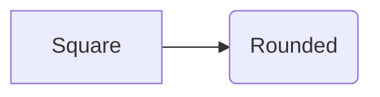

This package exposes the Mermaid CLI as a repository-wide Bazel tool. Bazel
provisions the pinned Node toolchain, JavaScript dependency graph, Mermaid CLI,
and Chrome-for-Testing browser used by Puppeteer. Rendering runs as a Bazel
target or action; it does not use a host browser, download one during an npm
lifecycle hook, or fetch scripts or fonts from a CDN.

[`theme.json`](theme.json) owns the diagram appearance. It applies a
documentation palette, typography, layout, and the `handDrawn` look to every
diagram, so rendered work shares one visual contract instead of Mermaid's
built-in default. Shapes stay semantic: `()` and other inherently rounded
shapes render rounded, while `[]` boxes render as sketched rectangles. Nothing
forces every node into a rounded outline.

The `mermaid_svg` rule and the `mmdc` target both apply the theme by default.
A diagram can override any part of it with its own Mermaid directive, which
Mermaid merges over the file config:



`handDrawnSeed` is fixed, so the sketch jitter is stable rather than different
on every render. Pass `theme` on the rule or a later `-c` argument to the CLI
to replace the whole config for one diagram; because a second `-c` file
replaces rather than merges, override only the specific keys you need with a
directive.

## Hermetic rendering

Mermaid measures label text through Fontconfig, so a renderer that follows the
host would produce different canvas geometry on every machine. Both entry
points instead expose only the repository's pinned Liberation fonts to Chrome:
`cmd/render/fontconfig.mjs` writes a Fontconfig file whose sole `<dir>` is
those fonts and whose aliases map the families the theme requests onto them.
The same file is applied by the build action and by an interactive `mmdc` run,
so both resolve identical text metrics.

The generated Fontconfig must use absolute paths. Chrome is a separate process
from the launcher, and a relative `<dir>` resolves against whatever working
directory it inherits rather than the action's execroot. Passing a caller's own
`-p`/`--puppeteerConfigFile` hands full control of the browser launch, and
including the font aliases in it, to that caller.

The JavaScript launcher runs from Bazel's output tree. Pass absolute paths when
rendering source-tree files directly:

```sh
repo_root="$PWD"
bazel_agent bazel run //tools/mermaid:mmdc -- \
  -i "${repo_root}/path/to/diagram.mmd" \
  -o "${repo_root}/path/to/diagram.svg"
```

Prefer a `mermaid_svg` action plus `write_source_file` for maintained diagrams;
those targets use declared Bazel paths and need no absolute-path handling.
