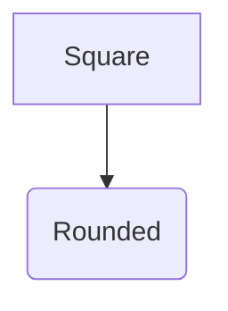

# Write repository diagrams

Read [`tools/mermaid/README.md`](../../README.md) for the theme contract and the
measured reasons behind each setting before changing a diagram that depends on
one of them.

## Prefer the Bazel rule

Declare a maintained diagram as a `mermaid_svg` action and copy its output into
the source tree with `write_source_files`:

```starlark
load("@aspect_bazel_lib//lib:write_source_files.bzl", "write_source_files")
load("//tools/mermaid:defs.bzl", "mermaid_svg")

mermaid_svg(
    name = "rendered",
    src = "architecture.mmd",
    out = "rendered/architecture.svg",
)

write_source_files(
    name = "update",
    files = {"assets/architecture.svg": ":rendered/architecture.svg"},
)
```

Regenerate the committed SVG with `bazel_agent bazel run //<package>:update`.
This is the only path that applies the paint-order post-processing described
below, and it needs no absolute-path handling because both paths are Bazel
outputs.

Commit the `.mmd` source as the authoritative diagram. The SVG is a rendered
projection; never hand-edit it.

## Write `flowchart TB`

Vertical is the repository default. ELK lays a `flowchart LR` graph out wide
and flat, and its width is not meaningfully controllable from config: the
`nodeSpacing`, `rankSpacing`, and `wrappingWidth` keys are inert, and the
placement-strategy and edge-merging keys move the width by at most about 2%.
Direction is the lever, and a `flowchart TB` graph of the same nodes measures
roughly a third of the `LR` width.

Set `direction` per subgraph when one container genuinely reads better
horizontally; keep the file overall vertical.

## Keep theme changes in `tools/mermaid/theme.json`

The theme owns appearance, so a diagram carries structure and labels only. A
diagram that needs a different look should not carry a local `themeCSS` block:
change the theme when the look should apply everywhere.

A diagram may still override a specific key with a Mermaid directive, because
Mermaid merges a directive over the file config:



Shapes stay semantic. `()` and the other inherently rounded shapes render
rounded, `[]` renders as a sketched rectangle, and nothing forces every node
into one outline. Pick the shape for what the node means rather than for the
look.

A container is the exception to local freedom: ELK sizes a container from the
width of its own title plate, so a child container whose title is wider than
its parent's escapes the parent. Titles that must nest keep to short text, and
the theme's `13px` title size exists to keep a nested hostname inside a short
parent title. Verify containment from the rendered SVG rather than by eye.

## Render hermetically

The theme is applied by default, both entry points pin Chrome, and both expose
only the repository's pinned fonts through Fontconfig. Never add a CDN script,
a `<script type="module">` import, a downloaded font, or a network fetch to a
diagram or theme: rendering must resolve everything from the Bazel graph.

For an interactive render, `mmdc` needs absolute paths because the launcher
runs from Bazel's output tree:

```sh
repo_root="$PWD"
bazel_agent bazel run //tools/mermaid:mmdc -- \
  -i "${repo_root}/path/to/diagram.mmd" \
  -o "${repo_root}/path/to/diagram.svg"
```

`mmdc` applies the same theme, pinned fonts, and paint-order fix as a build
action, so an interactive render matches the committed one. It writes only the
file named by `-o` or `--output`, so an SVG printed to stdout is not rewritten.
Always re-render a maintained diagram through its `mermaid_svg` target before
handoff, which is the only path a build action verifies.

## Verify

Render the diagram and inspect the output rather than the source. A change is
complete when the container titles are readable, no title escapes its parent
container, and no edge crosses a title plate. `//tools/mermaid/test/renderer`
holds the fixtures that pin these properties; extend them when a change
introduces a new condition.
